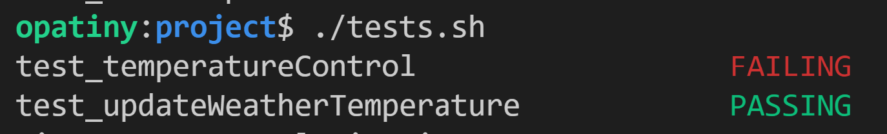

# Easy C test environment

## Concept
We created a very easy environment to test C code. Basically, a bash script, `tests.sh` has to be run every time the code has to be tested. The script does a bunch of stuff, and in the end, it shows an ouput that looks like this:

## `tests.sh` actions
This script:
-  automatically generates the `tests.c` file, based on all the files in subfolders which have the extension `.test.c`
- compiles `tests.c` and all the other C files that are in subfolders
- outputs `tests.out`
- runs `tests.out`

## The test files

## Important conventions to follow

A few conventions have to be respected for the tests to work:
- there must not be any file containing a `main()` function in any of the subfolders of the project

Additionnally these conventions are used, but are not mandatory:
- all test files are placed in subfolders that are called `__tests__`
